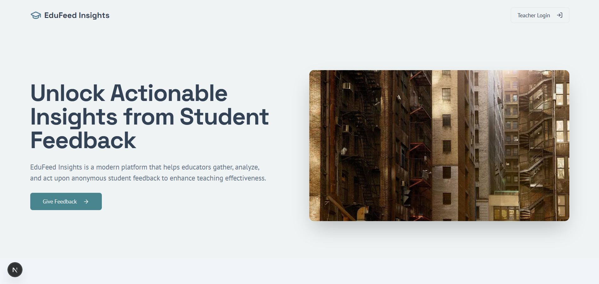
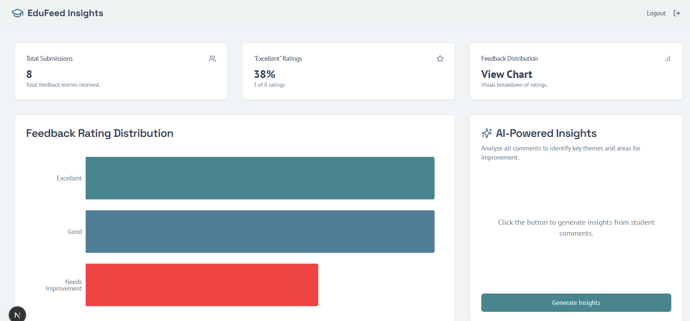

## Screenshots 
Aim : Feedback Collector for Lectures
Create a React app that collects anonymous feedback from students after a lecture or lab session. Students should be able to select ratings (e.g., Excellent, Good, Needs Improvement) and optionally add short comments. The teacher’s dashboard should display a summarized report with counts or percentages in chart form. This will allow faculty to reflect on teaching effectiveness and address student concerns in real time.

